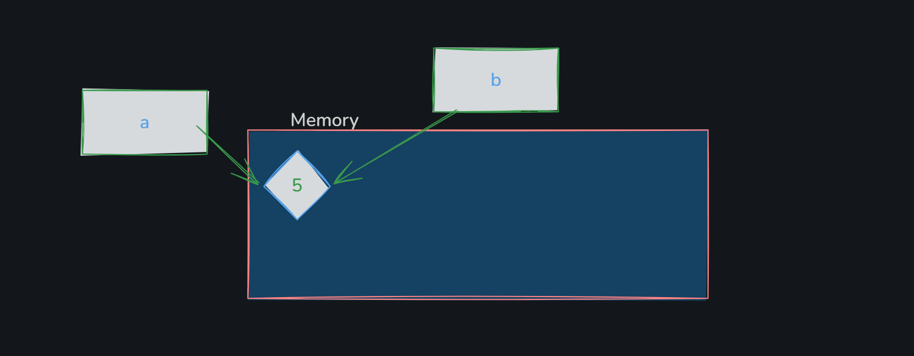
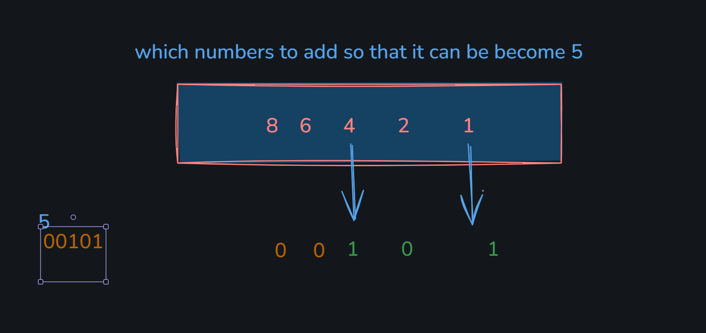

# Python Operators

## Operators

- Operators are special symbols used to perform operations on values and variables.
- Python has different types of operators.

## 1. Arithmetic Operators

- Used to perform mathematical calculations.
- Examples:
  - Addition (`+`)
  - Subtraction (`-`)
  - Multiplication (`*`)
  - Division (`/`)
  - Floor Division (`//`)
  - Modulus / Remainder (`%`)
  - Power (`**`)

## 2. Comparison Operators

- Used to compare two values.
- Returns a Boolean value (`True` or `False`).
- Examples:
  - Equal to (`==`)
  - Not equal to (`!=`)
  - Greater than (`>`)
  - Less than (`<`)
  - Greater than or equal to (`>=`)
  - Less than or equal to (`<=`)

## 3. Assignment Operators

- Used to assign values to variables.
- Examples:
  - Assign (`=`)
  - Add and assign (`+=`)
  - Subtract and assign (`-=`)
  - Multiply and assign (`*=`)
  - Divide and assign (`/=`)

## 4. Logical Operators

- Used to combine multiple conditions.
- Examples:
  - `and` → Returns True if both conditions are true.
  - `or` → Returns True if at least one condition is true.
  - `not` → Reverses the result.

## 5. Identity Operators

- Used to check whether two variables refer to the same object in memory.
- Examples:
  - `is`
  - `is not`

## 6. Membership Operators

- Used to check whether a value exists in a sequence.
- Examples:
  - `in`
  - `not in`

## 7. Bitwise Operators

- Used to perform operations on binary numbers (bits).
- Bitwise operators perform operations directly on the binary representation of numbers (bits). They are mainly used in low-level programming, optimization, cryptography, and hardware-related tasks.

- Examples:
  - AND (`&`)
  - OR (`|`)
  - XOR (`^`)
  - NOT (`~`)
  - Left Shift (`<<`)
  - Right Shift (`>>`)